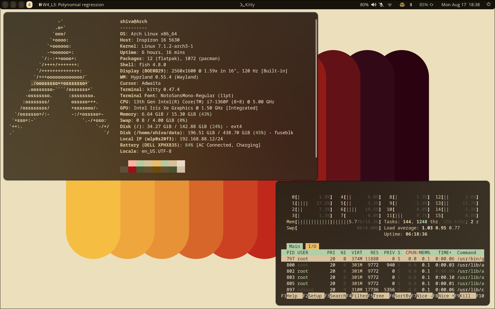
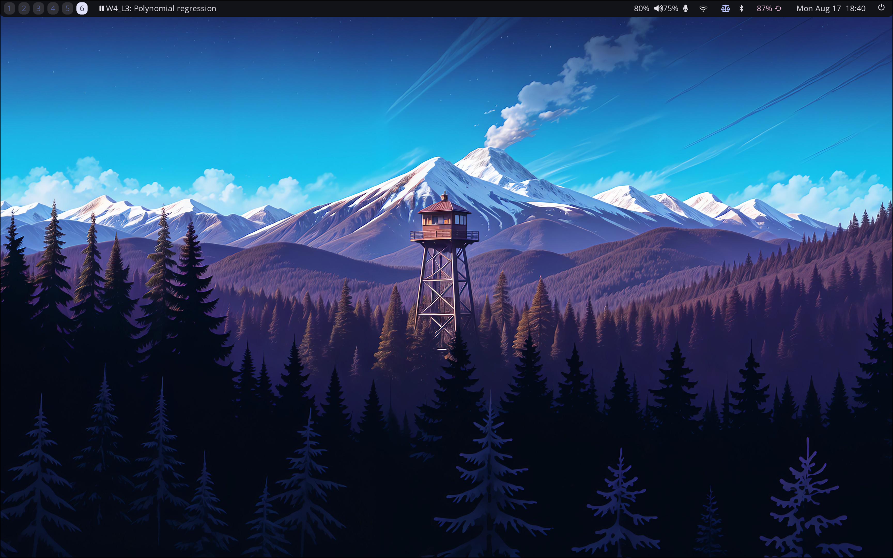
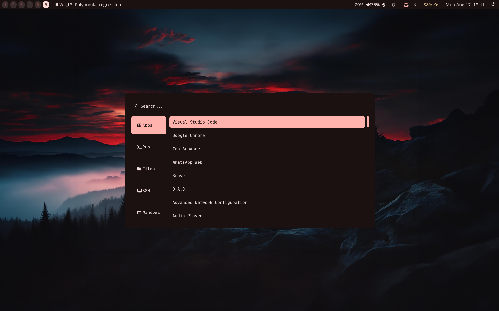

# 🌌 Hyprland Configuration (`hypr_config`)

A personal collection of configuration files (dotfiles) for **Hyprland**, a dynamic tiling Wayland compositor, designed for a modern, fast, and customizable desktop environment on Linux.

---

## 🛠️ Overview & Features

- **Window Manager:** [Hyprland](https://hyprland.org/) (Wayland Compositor)
- **Status Bar:** Waybar / Custom Bar
- **App Launcher:** Rofi / Wofi
- **Terminal:** Kitty 
- **Wallpaper Engine:** `swww`

---

## 📋 Prerequisites

Ensure you have installed Hyprland and standard Wayland utilities on your system.

### Dependencies

On **Arch Linux**, you can install common dependencies with:

```bash
sudo pacman -S hyprland waybar rofi-wayland dunst kitty swww grim slurp wl-clipboard polkit-gnome
```

(Adjust the packages above depending on the exact utilities used in this config).

---

## 🚀 Installation & Usage

**1. Clone the Repository:**

```bash
git clone https://github.com/ShivaDoulagar/hypr_config.git
```

**2. Backup Existing Configuration:**

Before applying new configurations, back up your current Hyprland setup:

```bash
mv ~/.config/hypr ~/.config/hypr.bak
```

**3. Deploy the Config:**

Copy or link the contents of this repository to your `~/.config/hypr/` directory:

```bash
cp -r hypr_config/* ~/.config/hypr/
```

Alternatively, create a symbolic link:

```bash
ln -s ~/path/to/hypr_config ~/.config/hypr
```

**4. Reload Hyprland:**

Press `SUPER + M` (or your configured exit/reload key combination) or run:

```bash
hyprctl reload
```

---

## 🖥️ Display & Monitor Configuration

Be sure to verify or update your display settings in `hyprland.conf`:

```ini
# Edit monitor settings to match your display resolution and refresh rate
# Syntax: monitor=name,resolution,position,scale
monitor=,preferred,auto,1
```

---

## ⌨️ Common Keybindings (Default Example)

| Keybinding | Action |
|---|---|
| `SUPER + ENTER` | Open Terminal |
| `SUPER + Q` | Close Active Window |
| `SUPER + E` | Open File Manager |
| `SUPER + SPACE` | Application Launcher |
| `SUPER + V` | Toggle Floating Window |
| `SUPER + M` | Exit / Reload Hyprland |

---

## change the wallpaper
```
    matugen image <path>
```

## Images
   
   



### Tips for customizing this further

- If your setup uses specific tools (like `swww` for wallpapers, `waybar` for status, or a specific terminal like `kitty`), you can replace the placeholder names under **Overview & Features**.
- You can add a `screenshots` folder to your repo and link an image under the title using `` to show off how the desktop looks!
